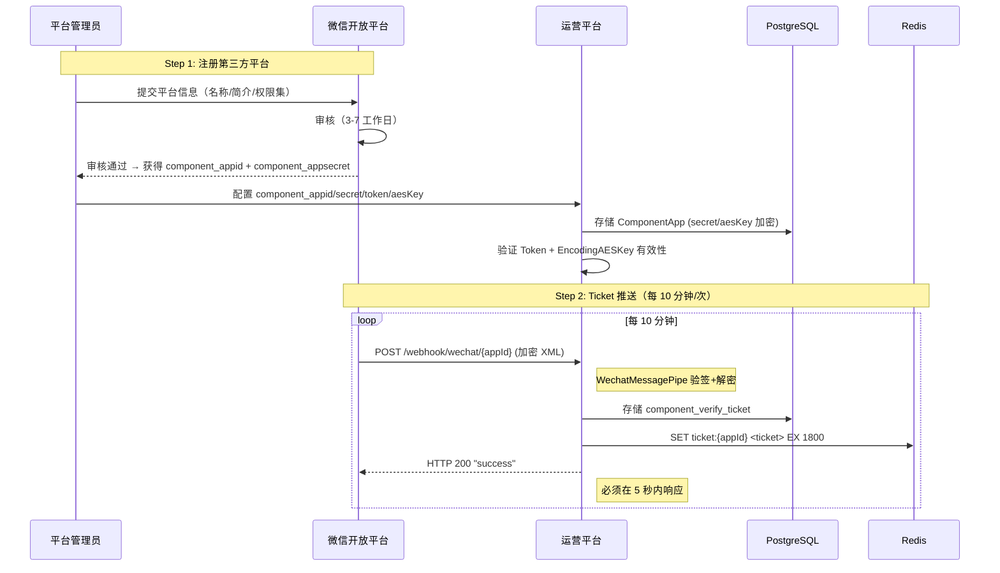
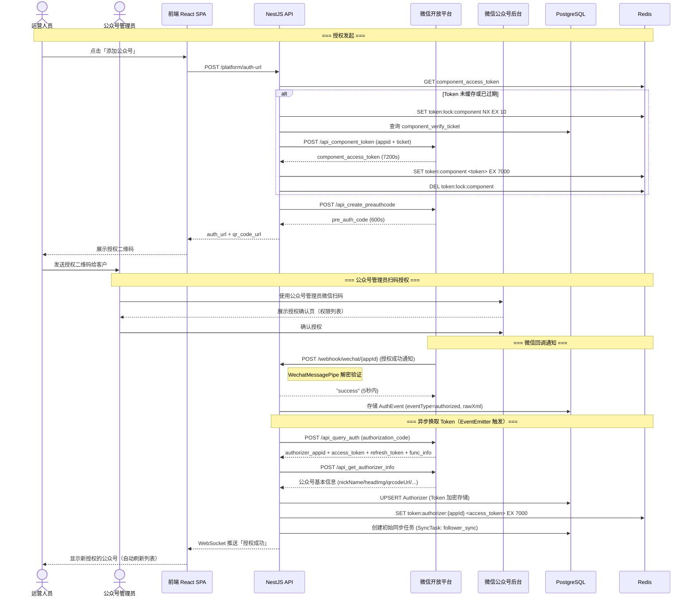
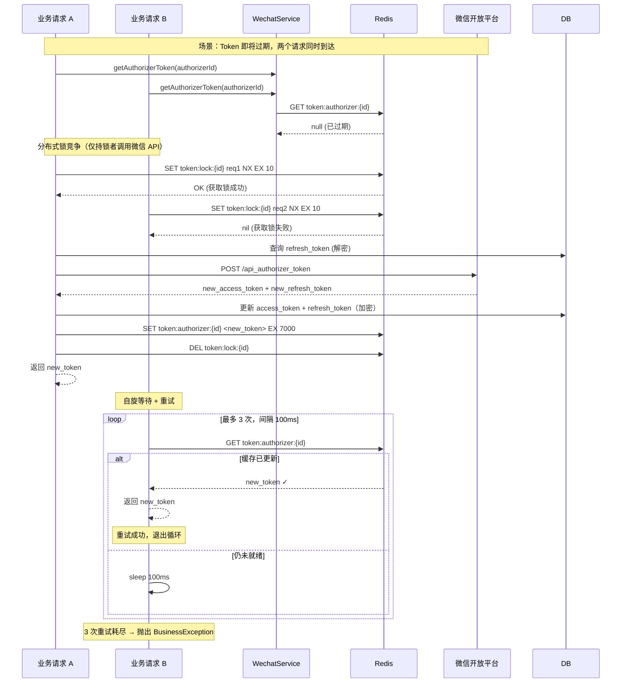
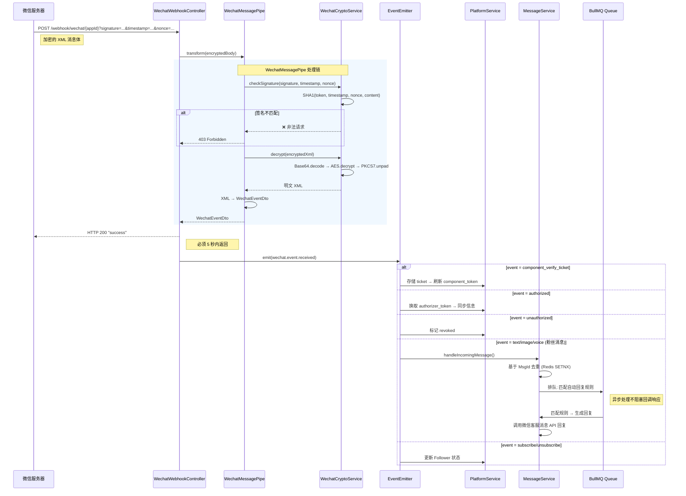
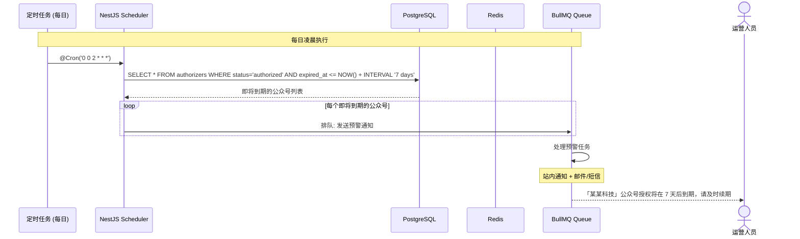

# 微信公众号第三方平台 — 授权流程设计

> 版本: v1.0.0 | 日期: 2026-05-29

---

## 1. 第三方平台注册与 Ticket 推送



## 2. 公众号授权流程（完整链路）



## 3. Token 刷新与竞态控制



## 4. 微信消息回调处理流程



## 5. 授权到期预警流程



---

## 6. 核心数据结构流转

```
微信回调 (XML 加密)
  │
  ├─ WechatMessagePipe
  │   ├─ checkSignature(SHA1) → bool
  │   ├─ decrypt(AES-256-CBC-PKCS7) → XML String
  │   └─ parse(xml2js) → WechatEventDto
  │
  ├─ EventEmitter.emit(event)
  │   ├─ 'component_verify_ticket'
  │   │   └─ ComponentApp.verifyTicket (DB)
  │   │   └─ [触发] refreshComponentToken()
  │   │       └─ POST /api_component_token → component_access_token (Redis, 7000s)
  │   │
  │   ├─ 'authorized'
  │   │   └─ AuthEvent (DB)
  │   │   └─ [触发] queryAuth()
  │   │       └─ POST /api_query_auth → authorizer_access_token + refresh_token
  │   │       └─ [触发] getAuthorizerInfo()
  │   │           └─ POST /api_get_authorizer_info → 基本信息
  │   │           └─ Upsert Authorizer (DB)
  │   │           └─ authorizer_access_token → Redis (7000s)
  │   │
  │   ├─ 'unauthorized'
  │   │   └─ Authorizer.status = 'revoked' (DB)
  │   │   └─ 清理 Redis 缓存 + 操作日志
  │   │
  │   └─ 'message/text/image/voice/video/location/link/event'
  │       └─ MessageLog (DB, INSERT ... ON CONFLICT(msgId) DO NOTHING)
  │       └─ [异步] 匹配自动回复规则
  │           ├─ 精确匹配 → 模糊匹配 → 正则匹配 → 默认回复
  │           └─ 调用微信客服消息 API 回复
  │       └─ [异步] 更新 Follower 互动计数
  │       └─ [异步] 触发标签规则评估
  │       └─ [异步, event=subscribe] Follower.upsert (openid)
  │       └─ [异步, event=unsubscribe] Follower.subscribe = false
```
